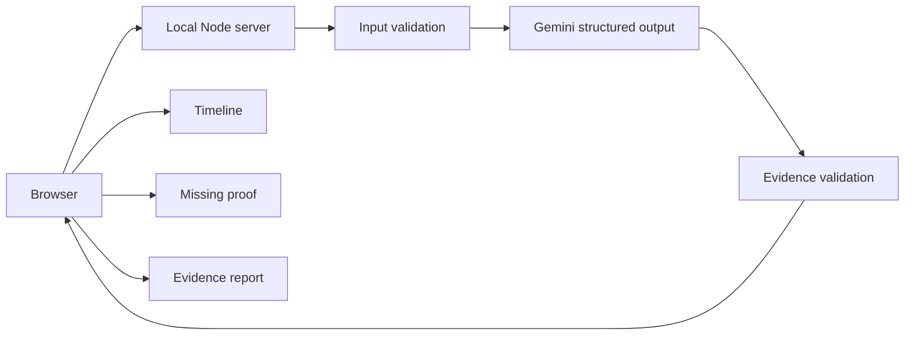

# ProofPath

**Turn scattered evidence into a clear, verifiable story.**

ProofPath is a focused AI proof of concept that turns a small set of messages, receipts, screenshots, and documents into a **source-linked timeline**, visible **evidence status**, identified **missing proof**, and a readable **evidence report**.

> **Project status:** Hackathon proof of concept · Node.js + Gemini · MIT licensed

ProofPath is an evidence-organization tool. It does not determine who is right, provide legal advice, or establish legal truth.

## Why ProofPath

Messy records are difficult to reason about when important details are spread across screenshots, messages, receipts, and documents. ProofPath keeps the analysis traceable:

**Evidence → Timeline → Evidence Status → Missing Proof → Report**

The important design rule is simple: a result should point back to the evidence that produced it.

## Try it locally

### Requirements

- Node.js **22.21.0 or newer**
- A Gemini API key from Google AI Studio
- Network access to the Gemini API

Node.js 22.21.0 is used because ProofPath relies on Node's stable `--env-file-if-exists` support.

### Setup

1. Clone the repository.
2. Copy `.env.example` to `.env`.
3. Add your key:
   ```env
   GEMINI_API_KEY=your_key_here
   ```
4. Start the app:
   ```sh
   npm start
   ```
5. Open **http://localhost:3000** and choose **Try Demo Packet**.

The project has no runtime npm dependencies, so there is no package installation step beyond having Node.js available.

## What the demo shows

The fictional packet represents an online-purchase dispute with five records:

1. Seller conversation
2. Payment confirmation
3. Order confirmation
4. Delivery promise
5. Follow-up conversation

ProofPath sends the packet through the live Gemini analysis route, then validates the returned source references before rendering the result.

The key moment is the distinction between:

- **Supported** — directly supported by submitted evidence
- **Uncertain** — relevant evidence exists, but it is ambiguous, incomplete, or conflicting
- **Missing** — the submitted evidence does not establish the event

A contradiction is only shown when different submitted files contain incompatible details. A missing record by itself is a gap, not a contradiction.

## Analyze your own evidence

Choose **Upload Evidence**, select up to five files, review the selection, remove anything you do not want analyzed, and choose **Analyze Evidence**.

Supported formats:

| Format | Limit | Handling |
| --- | ---: | --- |
| TXT | 2 MB/file | Read as UTF-8 text |
| PDF | 2 MB/file | Sent to Gemini as file content |
| PNG | 2 MB/file | Sent to Gemini as file content |
| JPG/JPEG | 2 MB/file | Sent to Gemini as file content |

The combined selection is limited to **10 MB**.

Files are kept in browser memory for the active session and are not written to a database or disk by ProofPath.

## Privacy and safety

Analysis content is sent to Google Gemini using the API key configured on the local server. Provider data handling depends on the account and Google's current terms.

**Do not upload private, financial, identity, or real dispute records to this proof of concept.** Use the synthetic demo or other non-sensitive test files.

ProofPath also validates that:

- source IDs refer to submitted files;
- unavailable files cannot be cited;
- Supported events have direct evidence;
- Uncertain events have a relevant source;
- Missing events do not claim supporting evidence;
- contradictions cite at least two distinct files.

These checks validate the structure and provenance of the AI response; they do not prove that a model-extracted quote or interpretation is semantically correct. Always inspect the original evidence.

## Architecture



The report is rendered from the same validated analysis shown in the timeline. It does **not** make a second AI request.

### Repository structure

```text
proofpath/
├── public/
│   ├── index.html          # App screens and accessible markup
│   ├── app.js              # Client state, file review, analysis rendering
│   ├── styles.css          # Responsive visual system
│   ├── favicon.svg         # Browser identity
│   └── demo/               # Five synthetic evidence records
├── test/
│   └── server.test.mjs     # Evidence-validation tests
├── devpost/
│   ├── scope.md            # Approved product boundary
│   ├── prd.md              # Product requirements
│   ├── spec.md             # Technical specification
│   └── app-map.html        # Developer architecture reference
├── server.mjs              # Static server, validation, Gemini route
├── package.json             # Scripts and project metadata
├── .env.example             # Local key template
├── .gitignore
├── LICENSE
└── README.md
```

## Development checks

Run the complete local check with:

```sh
npm run check
```

Or run the individual checks:

```sh
node --check server.mjs
node --check public/app.js
npm test
```

The tests use Node's built-in test runner and require no third-party test dependencies.

## Scope and limitations

ProofPath intentionally stays small. It has no:

- accounts or authentication
- persistent case storage
- cloud evidence library
- OCR pipeline
- automatic fact verification
- legal review or legal advice
- case sharing or collaboration
- production-grade evidence chain of custody

It is a demonstration of a source-grounded evidence-analysis workflow, not a production evidence-management system.

## Project documentation

The approved planning artifacts are kept under `devpost/` because they define the hackathon project's intended scope and implementation:

- [Scope](devpost/scope.md)
- [PRD](devpost/prd.md)
- [Technical specification](devpost/spec.md)
- [Developer app map](devpost/app-map.html)

## License

MIT License. See [LICENSE](LICENSE).

## Repository

https://github.com/peterkehinde673/proofpath
